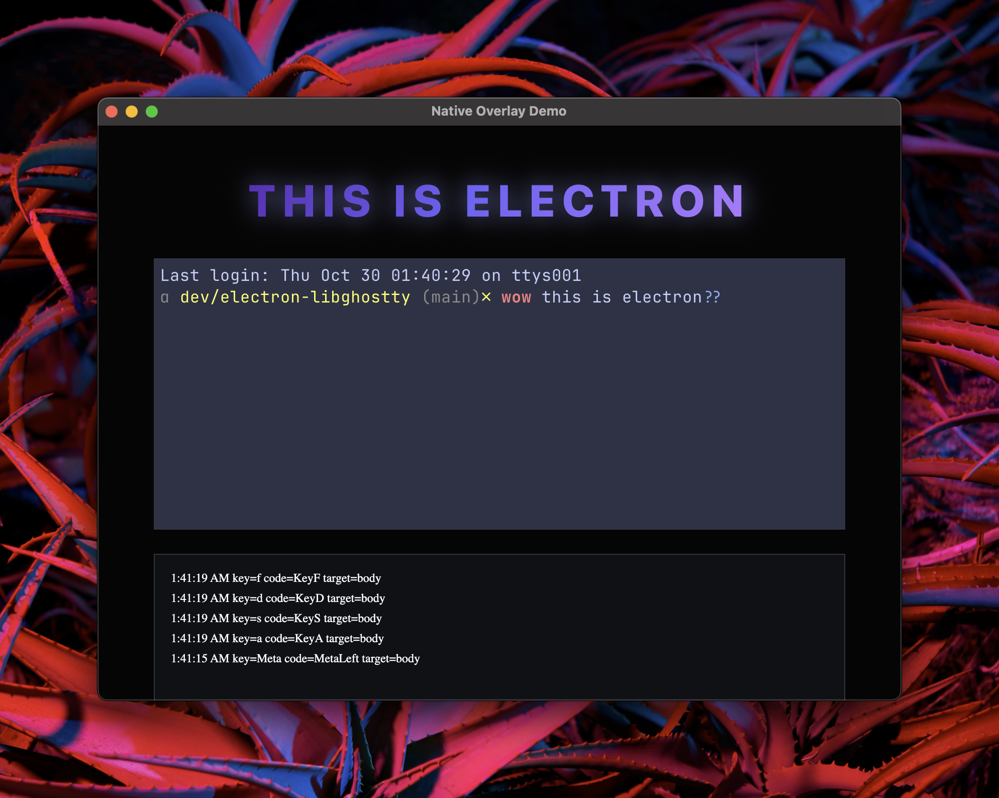

# electron-libghostty

<div align="center">




**Native libghostty terminal renderer for Electron**

_Embed high-performance Ghostty terminal surfaces directly in Electron windows_

[Installation](#-installation) • [Quick Start](#-quick-start) • [API](#-api-reference) • [Examples](examples/) • [Contributing](#-contributing)

</div>

---

> **⚠️ Preview Release**: This is a preview release. We're planning to migrate to [Shared Texture](https://github.com/electron/electron/pull/47317) for improved performance in future versions.

## ✨ Features

- 🖥️ **Native Terminal Rendering** – Powered by libghostty for native-quality terminal emulation
- ⚡ **High Performance** – Direct rendering to native macOS views
- 🎯 **Precise Positioning** – Overlay terminal surfaces anywhere in your Electron UI
- 📦 **Modern Package** – Dual ESM/CommonJS support with TypeScript declarations

## 🚀 Installation

```bash
pnpm add electron-libghostty
```

### Requirements

- **macOS 13 Ventura or later**
- **Electron 30+**
- **Node.js 22+**
- **Zig 0.14.0+** (only required when building libghostty locally)

> **Note**: This package only works on macOS.

## 🎯 Quick Start

### Main Process (Electron)

```typescript
import { app, BrowserWindow, ipcMain } from 'electron'
import ghosttyHost from 'electron-libghostty'

let mainWindow: BrowserWindow
let surfaceId: number | null = null

app.whenReady().then(() => {
  mainWindow = new BrowserWindow({
    width: 800,
    height: 600,
    webPreferences: {
      nodeIntegration: true,
      contextIsolation: false,
    },
  })

  mainWindow.loadFile('index.html')

  // Listen for events from the terminal
  ghosttyHost.onEvent((event) => {
    console.log('[ghostty] event', event)
  })

  // Handle focus/blur
  mainWindow.on('focus', () => {
    if (surfaceId !== null) {
      ghosttyHost.setFocus(surfaceId, true)
    }
  })

  mainWindow.on('blur', () => {
    if (surfaceId !== null) {
      ghosttyHost.setFocus(surfaceId, false)
    }
  })
})

// Create terminal surface at specified bounds
ipcMain.on('native-overlay:update', (_event, rect) => {
  if (surfaceId === null) {
    surfaceId = ghosttyHost.create(
      mainWindow.getNativeWindowHandle(),
      rect
    )
  } else {
    ghosttyHost.resize(surfaceId, rect)
  }
})

// Clean up terminal surface
ipcMain.on('native-overlay:hide', () => {
  if (surfaceId !== null) {
    ghosttyHost.destroy(surfaceId)
    surfaceId = null
  }
})
```

### Renderer Process

```javascript
const { ipcRenderer } = require('electron')

// Calculate terminal bounds from a DOM element
function getTargetRect() {
  const target = document.querySelector('#terminal-container')
  const rect = target.getBoundingClientRect()
  const scale = window.devicePixelRatio || 1

  return {
    x: rect.x,
    y: rect.y,
    width: rect.width,
    height: rect.height,
    scale,
  }
}

// Update terminal position
function updateTerminal() {
  const rect = getTargetRect()
  ipcRenderer.send('native-overlay:update', rect)
}

// Track element position changes
window.addEventListener('DOMContentLoaded', () => {
  const target = document.querySelector('#terminal-container')

  // Update on resize
  new ResizeObserver(() => updateTerminal()).observe(target)

  // Update on scroll
  window.addEventListener('scroll', updateTerminal, { passive: true })

  // Initial update
  updateTerminal()
})
```

## 📚 API Reference

### `ghosttyHost.create(handle, rect)`

Creates a new terminal surface overlay.

**Parameters:**
- `handle: Buffer` - The native window handle from `BrowserWindow.getNativeWindowHandle()`
- `rect: { x: number, y: number, width: number, height: number, scale?: number }` - Position and size

**Returns:** `number` - Surface ID for future operations

### `ghosttyHost.resize(surfaceId, rect)`

Updates the position and size of an existing terminal surface.

**Parameters:**
- `surfaceId: number` - The surface ID returned from `create()`
- `rect: { x: number, y: number, width: number, height: number, scale?: number }` - New bounds

### `ghosttyHost.destroy(surfaceId)`

Destroys a terminal surface.

**Parameters:**
- `surfaceId: number` - The surface ID to destroy

### `ghosttyHost.setFocus(surfaceId, focused)`

Sets the focus state of a terminal surface.

**Parameters:**
- `surfaceId: number` - The surface ID
- `focused: boolean` - Whether the surface should be focused

### `ghosttyHost.setOccluded(surfaceId, occluded)`

Sets the occlusion state (visibility) of a terminal surface.

**Parameters:**
- `surfaceId: number` - The surface ID
- `occluded: boolean` - Whether the surface is occluded (hidden)

### `ghosttyHost.onEvent(callback)`

Registers a callback for terminal events.

**Parameters:**
- `callback: (event: any) => void` - Event handler function

## 🏗️ How It Works

electron-libghostty embeds native Ghostty terminal surfaces as overlays within Electron windows:

1. **Native Terminal**: Uses libghostty's native macOS rendering for high-performance terminal emulation
2. **Overlay Positioning**: Terminal surfaces are positioned over Electron web content at specified coordinates
3. **Event Handling**: Keyboard and mouse events are properly routed to the terminal surface
4. **Lifecycle Management**: Surfaces can be created, resized, focused, and destroyed dynamically

See the [examples/](examples/) directory for a complete working implementation.

## 🔧 Development

### Building from Source

```bash
git clone https://github.com/meridius-labs/electron-libghostty.git
cd electron-libghostty

pnpm install

# Build native module
pnpm run build:native

# Build TypeScript library
pnpm run build

# Build everything
pnpm run build:all
```

### Project Structure

```
electron-libghostty/
├── src/                    # Native Objective-C++ source
│   ├── overlay_view.mm     # Terminal surface overlay
│   └── liquidglass.cc      # Node.js addon bindings
├── js/                     # TypeScript source
│   └── index.ts            # Main library code
├── third_party/libghostty/ # Ghostty terminal library
├── examples/               # Example application
└── dist/                   # Built library (generated)
```

## 🤝 Contributing

Contributions are welcome! Please open an issue or PR on [GitHub](https://github.com/meridius-labs/electron-libghostty).

## 🙏 Acknowledgments

- [Ghostty](https://github.com/ghostty-org/ghostty) - The excellent terminal emulator that powers this library
- The Electron team for native integration capabilities

## 📄 License

MIT © [Meridius Labs](https://github.com/meridius-labs) 2025

---

<div align="center">

**Made with ❤️ for the Electron community**

[⭐ Star on GitHub](https://github.com/meridius-labs/electron-libghostty) • [🐛 Report Bug](https://github.com/meridius-labs/electron-libghostty/issues) • [💡 Request Feature](https://github.com/meridius-labs/electron-libghostty/issues)

</div>
